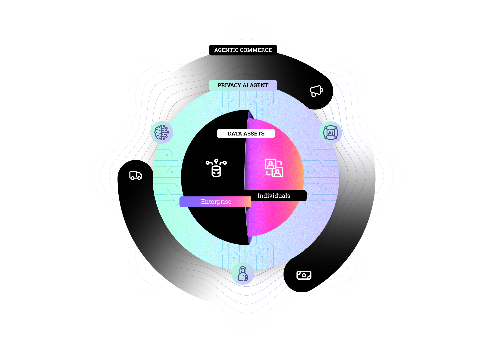

# Core Protocol Repository

The **[DataHive Core Protocol](/docs/protocol/overview.md)** powers the DataHive ecosystem, currently deployed on **[OP Sepolia](/docs/network/op-sepolia.md)** (testnet1). This protocol serves as the foundation for **[secure data operations](/docs/protocol/data-ops.md)**, **[node coordination](/docs/protocol/node-coordination.md)**, and integration with our **[Storage Layer](https://github.com/datahiv3/Storage-Layer/blob/d722c7a364797408d40238d9f0debd043636a9d2/README.md)**, enabling **[privacy-preserving AI compute](/docs/ai/privacy-compute.md)** across the network.

## 🌟 Characteristics
- **[Decentralized by Design](/docs/architecture/zero-trust.md)**: Zero-trust architecture with blockchain-powered verification and trust
- **[AI-Powered Privacy](/docs/ai/privacy-computing.md)**: On-device AI with differential privacy and federated learning
- **[Self-Sovereign Data](/docs/data/sovereignty.md)**: Users maintain complete control through cryptographic data vaults
- **[Multi-Node Intelligence](/docs/nodes/distributed-compute.md)**: Specialized nodes working in harmony through distributed tensor computation

## 🔄 Active Development
- **[Testnet1 Integration](/docs/network/testnet1.md)**: Live on OP Sepolia, integrated with 0G AIOS
- **[LN1 Node Program](/docs/nodes/ln1-program.md)**: Active onboarding of Legalese Nodes
- **[Nucleus Deployment](/docs/deployments/nucleus.md)**: Pilot program for educational data protection
- **[Developer Resources](/docs/developers/README.md)**: Comprehensive documentation and integration guides

**Quick Links:**
- [🔧 Node Setup Guide](/docs/nodes/setup-guide.md)
- [📊 Network Status](https://status.datahive.network)
- [💻 Developer Portal](/docs/developers/getting-started.md)

## 🔄 Node Architecture

## 🤖 Agentic Layer
The protocol's agentic layer enables secure, user-controlled AI operations across the network:

### Network Infrastructure
- **[0G Protocol](https://github.com/datahiv3/Storage-Layer/blob/d722c7a364797408d40238d9f0debd043636a9d2/docs/0g-protocol.md)**: Decentralized compute and storage layer
- **[Storage Node Network](https://github.com/datahiv3/Storage-Layer/blob/d722c7a364797408d40238d9f0debd043636a9d2/docs/storage-node-network.md)**: Self-healing mesh topology with DHT routing
- **[Protocol Agnostic Layer](https://github.com/datahiv3/Storage-Layer/blob/d722c7a364797408d40238d9f0debd043636a9d2/docs/protocol-agnostic.md)**: Parallel AI workload execution across nodes
- **[Zero-Knowledge Security](/docs/security/zkp-framework.md)**: Enterprise-grade encryption with attribute-based access

### Network Nodes
- **[Legalese Nodes](/docs/nodes/legalese.md)**: Smart contract-powered legal document processing
- **[Consent Nodes](/docs/nodes/consent.md)**: Granular permission management with blockchain audit trails
- **[Data Assetization Nodes](/docs/nodes/assetization.md)**: Tokenized data rights and value creation
- **[Data Securitization Nodes](/docs/nodes/securitization.md)**: Automated compliance and risk management

[➡️ Read our detailed Technical Architecture](/docs/ARCHITECTURE.md)  
[🔒 Learn about our Security Model](/docs/SECURITY.md)  
[🤖 Explore our AI Implementation](/docs/AI-SYSTEM.md)
