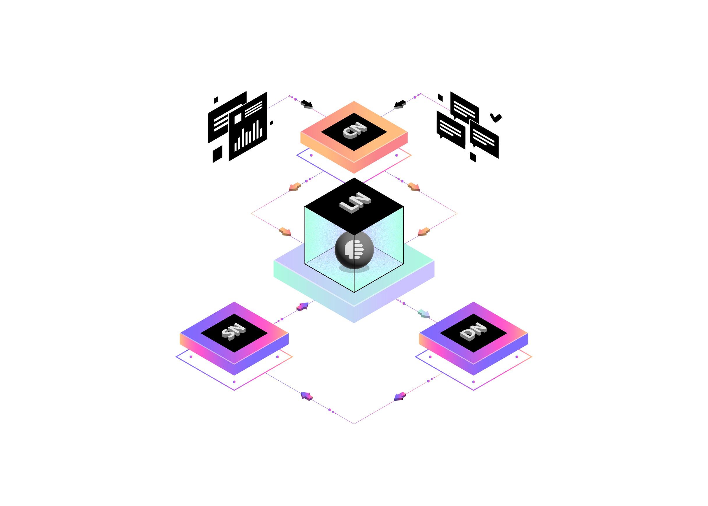

## 🌟 Characteristics
- **[Decentralized by Design](/docs/architecture/zero-trust.md)**: Zero-trust architecture with blockchain-powered verification and trust
- **[AI-Powered Privacy](/docs/ai/privacy-computing.md)**: On-device AI with differential privacy and federated learning
- **[Self-Sovereign Data](/docs/data/sovereignty.md)**: Users maintain complete control through cryptographic data vaults
- **[Multi-Node Intelligence](/docs/nodes/distributed-compute.md)**: Specialized nodes working in harmony through distributed tensor computation

## 🔄 Node Architecture

## 🛠 Core Components

### Network Infrastructure
- **[0G AI Operating System](/docs/infrastructure/0g-aios.md)**: Decentralized compute and storage layer
- **[P2P Overlay Network](/docs/infrastructure/p2p-mesh.md)**: Self-healing mesh topology with DHT routing
- **[Distributed Processing](/docs/infrastructure/distributed-compute.md)**: Parallel AI workload execution across nodes
- **[Zero-Knowledge Security](/docs/security/zkp-framework.md)**: Enterprise-grade encryption with attribute-based access

### Network Nodes
- **[Legalese Nodes](/docs/nodes/legalese.md)**: Smart contract-powered legal document processing
- **[Consent Nodes](/docs/nodes/consent.md)**: Granular permission management with blockchain audit trails
- **[Data Assetization Nodes](/docs/nodes/assetization.md)**: Tokenized data rights and value creation
- **[Data Securitization Nodes](/docs/nodes/securitization.md)**: Automated compliance and risk management

[➡️ Read our detailed Technical Architecture](/docs/ARCHITECTURE.md)  
[🔒 Learn about our Security Model](/docs/SECURITY.md)  
[🤖 Explore our AI Implementation](/docs/AI-SYSTEM.md)
